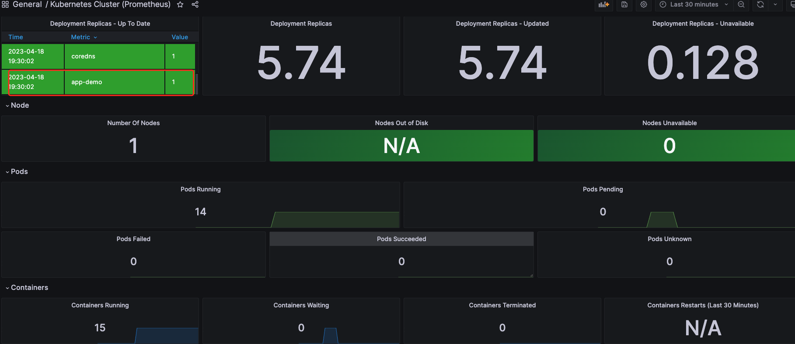

# 考题1（本地已部署jenkins和minikube）
    Jenkinsfile文件为一个demo，其中包括docker镜像打包和使用helm部署应用至minikube中，效果如下：

```bash
➜  pyton-app-demo git:(main) ✗ kubectl get pod
NAME                                                READY   STATUS    RESTARTS   AGE
app-demo-6b8878dd76-cf5ml                           1/1     Running   0          29m
grafana-6468b48cd4-w9lkz                            1/1     Running   0          17m
prometheus-alertmanager-0                           1/1     Running   0          26m
prometheus-kube-state-metrics-7f6769f7c6-vpp2r      1/1     Running   0          26m
prometheus-prometheus-node-exporter-s94lw           1/1     Running   0          26m
prometheus-prometheus-pushgateway-684dc6674-hwbk9   1/1     Running   0          26m
prometheus-server-b9bdb5877-twgf6

```

# 考题2（本地安装minikube）
## install prometheus
```bash
helm repo add prometheus-community https://prometheus-community.github.io/helm-charts

helm install prometheus prometheus-community/prometheus

#expose service by nodeport
kubectl expose service prometheus-server --type=NodePort --target-port=9090 --name=prometheus-server-np

kubectl get svc
# Expose Prometheus service in minikube:
minikube service prometheus-server-np --url
```

## Install Grafana

```bash
#add helm repo and install
helm repo add grafana https://grafana.github.io/helm-charts
helm install grafana grafana/grafana
#expose service by nodeport
kubectl expose service grafana --type=NodePort --target-port=3000 --name=grafana-np
kubectl get services
# get admin credentials
kubectl get secret --namespace default grafana -o jsonpath="{.data.admin-password}" | base64 --decode ; echo

# Expose Grafana service in minikube:
minikube service grafana-np --url

```
效果展示：
```bash
➜  pyton-app-demo git:(main) ✗ kubectl get pod
NAME                                                READY   STATUS    RESTARTS   AGE
app-demo-6b8878dd76-cf5ml                           1/1     Running   0          29m
grafana-6468b48cd4-w9lkz                            1/1     Running   0          17m
prometheus-alertmanager-0                           1/1     Running   0          26m
prometheus-kube-state-metrics-7f6769f7c6-vpp2r      1/1     Running   0          26m
prometheus-prometheus-node-exporter-s94lw           1/1     Running   0          26m
prometheus-prometheus-pushgateway-684dc6674-hwbk9   1/1     Running   0          26m
prometheus-server-b9bdb5877-twgf6

```



由于附加任务操作繁琐，暂时只提供目前项目上的实践思路

# 4（在Kubernetes集群中部署一个具有可水平扩展性的Web应用程序,该应用程序需要能够处理高流量和负载）
    水平可扩展性可以部署HPA按照CPU使用两对pod进行水平扩展，node节点扩展在eks上可以使用cluster autoscaling或者第三方工具（karpenter）

# 使用Prometheus和Grafana监测上述Web应用程序,并设置警报规则以在出现故障时发送通知。

    下面提供告警规则片段，当pod出现重启时告警

```yaml
    - name: k8s-rule-pod
      rules:
      - alert: pods-status
        expr: kube_pod_container_status_ready{namespace="default", app_kubernetes_io_managed_by="Helm"} != 1
        for: 1m
        labels:
          severity: warning
          team: wechat
          env: prod
        annotations:
          summary: "{{$labels.pod}} error"
          description: "{{$labels.pod}} has been down and rebooted repeatly for more than 1 minutes.."
```

# 6. 实现灰度部署流程,例如基于canary分析的部署,以确保应用程序更改不会导致生产故障。
    暂未实践istio或者OpenKruise Rollout

# 7. 配置集中式日志记录解决方案,例如ELK或EFK,以便在集群中的所有应用程序和组件中查找和调试问题。
    目前我们使用EFK（ES+Fluentd+Kibana）, Fluentd 会已deamonset的部署方式部署在每个节点上收取node节点上的日志,日志source配置如下

```
<source>
  @id fluentd-containers.log
  @type tail
  path /var/log/containers/*default*.log
  tag raw.kubernetes.*
  read_from_head true
  <parse>
    @type multi_format
    <pattern>
      format json
      time_key time
      time_format %Y-%m-%dT%H:%M:%S.%NZ
    </pattern>
    <pattern>
      format /^(?<time>.+) (?<stream>stdout|stderr) [^ ]* (?<log>.*)$/
      time_format %Y-%m-%dT%H:%M:%S.%N%:z
    </pattern>
  </parse>
</source>
```

# 8. terrraform 当前项目80%资源已实现terraform管理
